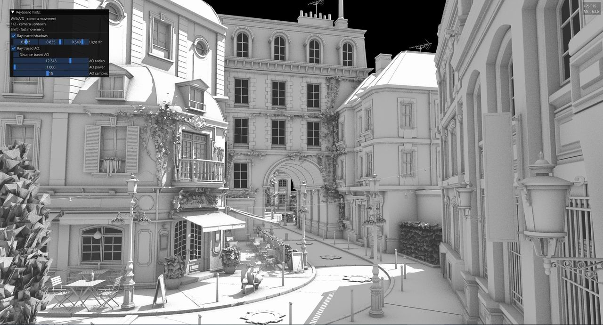

LightweightVK [](https://github.com/corporateshark/lightweightvk/actions)
========================

LightweightVK is a deeply refactored fork of [IGL](https://github.com/facebook/igl) which is designed to run on top of Vulkan 1.3 with optional mesh shaders and ray tracing support.

The main goals of LightweightVK:

1. **Lean.** Minimalistic API without bloat (no `std::vector`, `std::unordered_map` etc in the API).
2. **Bindless.** Utilize Vulkan 1.3+ dynamic rendering, descriptor indexing, and buffer device address features for modern bindless-only API design.
3. **Agile.** A playground for experiments to enable quick exploration of ideas and adoption of Vulkan API changes.
Designed for rapid prototyping of Vulkan-based renderers.

There are no plans to keep this fork in sync with the upstream.

## Supported rendering backends

 * Vulkan 1.3 (Windows, Linux, Android)
   * optional **VK_EXT_mesh_shader** (Windows, Linux)
   * optional **VK_KHR_acceleration_structure** (Windows, Linux)
   * optional **VK_KHR_ray_tracing_pipeline** (Windows, Linux)
 * Vulkan 1.2 + extensions (MacOS)

## Supported platforms

 * Linux
 * Windows
 * MacOS (via MoltenVK)
 * Android

## API Support

|                               | Windows                    | Linux                      | MacOS                      | Android                    |
| ----------------------------- | -------------------------- | -------------------------- | -------------------------- | -------------------------- |
| Vulkan 1.3                    | :heavy_check_mark:         | :heavy_check_mark:         | :heavy_exclamation_mark:   | :heavy_check_mark:         |
| Vulkan 1.2                    |                            |                            | :heavy_check_mark:         |                            |
| VK_EXT_mesh_shader            | :heavy_check_mark:         | :heavy_check_mark:         |                            |                            |
| VK_KHR_acceleration_structure | :heavy_check_mark:         | :heavy_check_mark:         |                            |                            |
| VK_KHR_ray_tracing_pipeline   | :heavy_check_mark:         | :heavy_check_mark:         |                            |                            |

On MacOS, features required by LightweightVK are enabled via extensions `VK_KHR_dynamic_rendering`, `VK_EXT_subgroup_size_control`,
`VK_EXT_extended_dynamic_state`, `VK_EXT_extended_dynamic_state2`, and `VK_KHR_synchronization2`.

:heavy_exclamation_mark: `VK_KHR_maintenance4` is not yet supported in MoltenVK :heavy_exclamation_mark:

Check the status of [Vulkan 1.3 support](https://github.com/KhronosGroup/MoltenVK/issues/1930) in MoltenVK.

## Build

Before building, run the deployment scripts:

```
python3 deploy_content.py
python3 deploy_deps.py

```

These scripts download external third-party dependencies. Please check [LICENSE.md](./LICENSE.md) for the full list.

### Windows

```
cd build
cmake .. -G "Visual Studio 17 2022"
```

### Linux

```
sudo apt-get install clang xorg-dev libxinerama-dev libxcursor-dev libgles2-mesa-dev libegl1-mesa-dev libglfw3-dev libglew-dev libstdc++-12-dev extra-cmake-modules libxkbcommon-x11-dev wayland-protocols
cd build
cmake .. -G "Unix Makefiles"
```

:heavy_exclamation_mark: Use `cmake .. -G "Unix Makefiles" -DLVK_WITH_WAYLAND=ON` to build for Wayland, X11 is used by default.

### MacOS

:heavy_exclamation_mark: Be sure that VulkanSDK 1.3.275.0 for MacOS is installed https://vulkan.lunarg.com/sdk/home#mac

```
cd build
cmake .. -G "Xcode"
```

### Android

:heavy_exclamation_mark: Be sure that [Android Studio](https://developer.android.com/studio) is set up.

:heavy_exclamation_mark: Be sure that the `ANDROID_NDK` environment variable points to your Android NDK.

:heavy_exclamation_mark: Be sure that the `JAVA_HOME` environment variable is set to the path of the Java Runtime.

:heavy_exclamation_mark: Be sure that the `adb` platform tool is in the `PATH` environment variable.

```
cd build
cmake .. -DLVK_WITH_SAMPLES_ANDROID=ON
cd android/Tiny                         # or any other sample
./gradlew assembleDebug                 # or assembleRelease
```
You can also open the project in Android Studio and build it from there.

Before running demo apps on your device, connect the device to a desktop machine and run the deployment script:

```
python3 deploy_content_android.py
```

> NOTE: To run demos on an Android device, it should support Vulkan 1.3. Please check https://vulkan.gpuinfo.org/listdevices.php?platform=android 

> NOTE: At the moment, no touch input is supported on Android.

## Screenshots

Check out [https://github.com/corporateshark/lightweightvk/samples](https://github.com/corporateshark/lightweightvk/tree/master/samples).




## Interop with raw Vulkan API calls

The header file `lvk/vulkan/VulkanUtils.h` offers a collection of functions that allow you to access the underlying Vulkan API objects from LightweightVK handles. This makes it easy to mix LVK and Vulkan code, as shown in the following example:

```
lvk::Holder<lvk::BufferHandle> vertexBuffer = ctx_->createBuffer({...});
...
lvk::ICommandBuffer& buffer = ctx_->acquireCommandBuffer();
VkCommandBuffer cmdBuf = getVkCommandBuffer(buffer);
VkBuffer buf = getVkBuffer(vertexBuffer);
vkCmdUpdateBuffer(cmdBuf, buf, 0, sizeof(params), &params);
ctx_->submit(buffer, ctx_->getCurrentSwapchainTexture());
```

If you'd like to add more helper functions, feel free to submit a pull request.

## License

LightweightVK is released under the MIT license, see [LICENSE.md](./LICENSE.md) for the full text as well as third-party library
acknowledgements.
