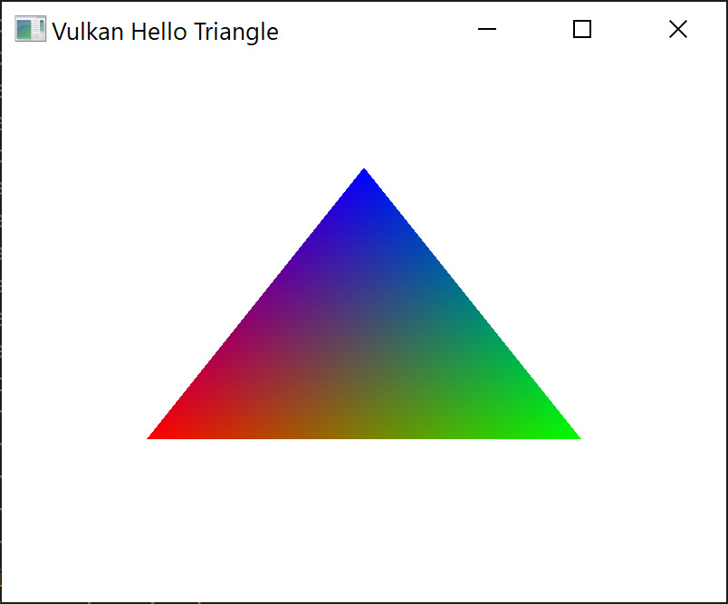
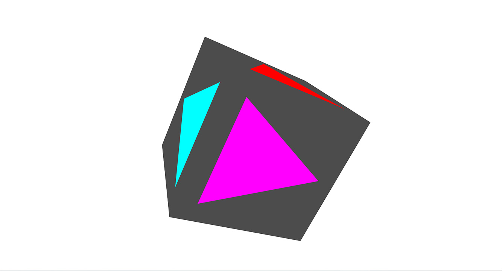
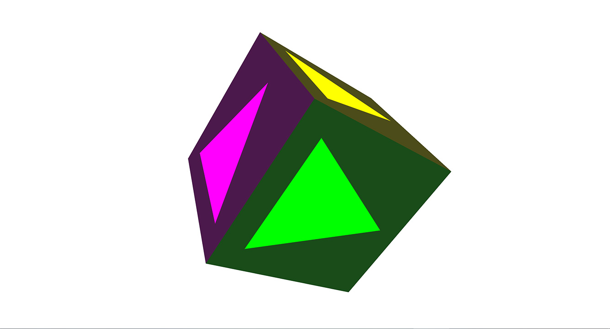
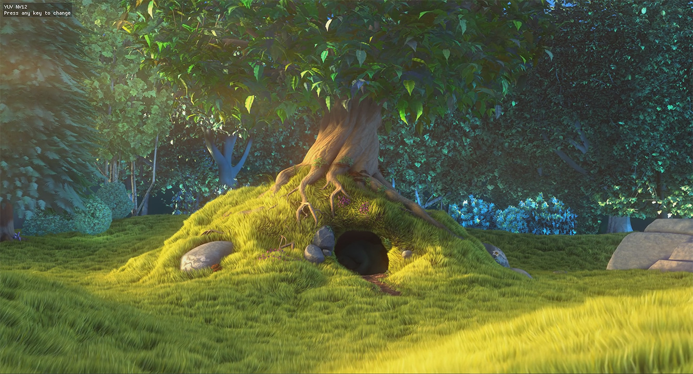
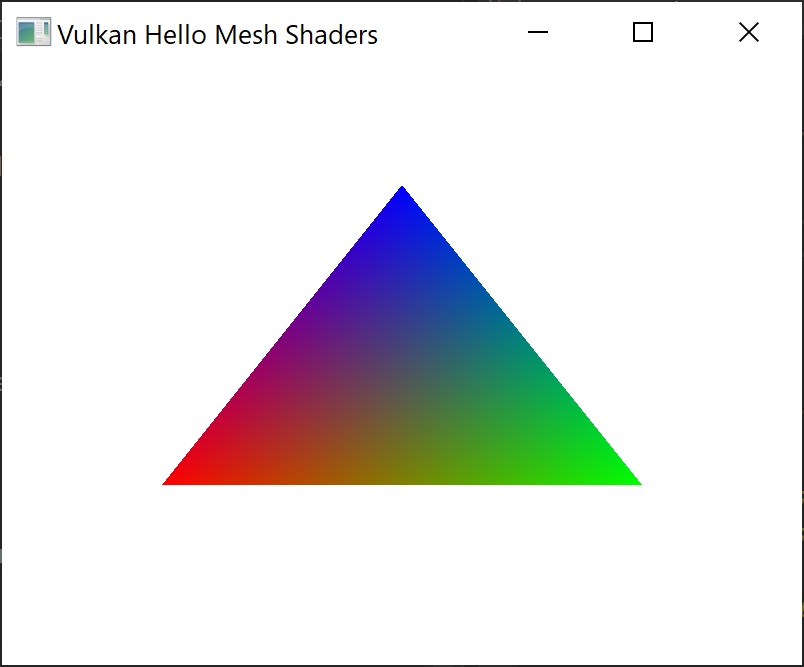
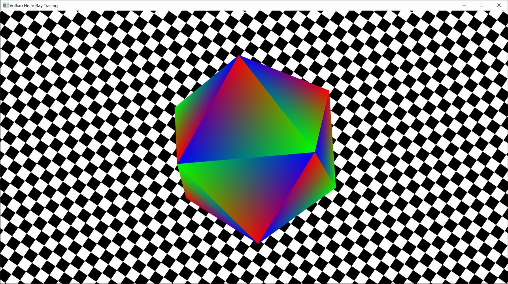
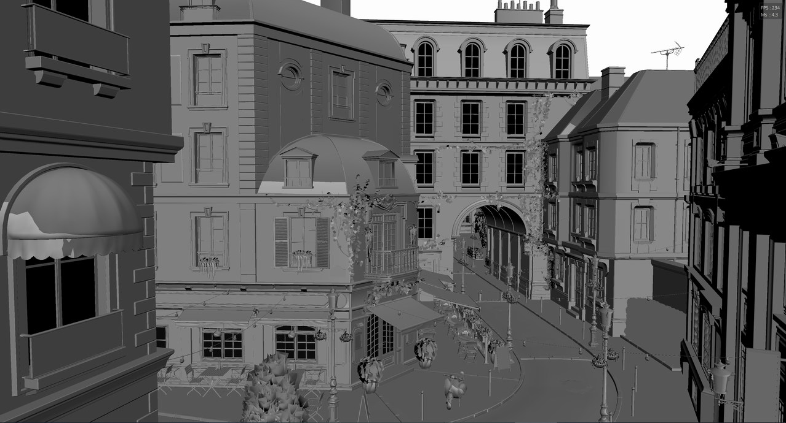
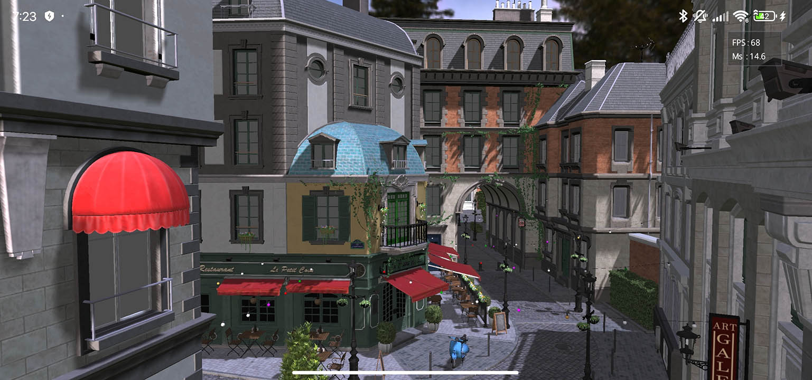

# LightweightVK Samples

## 001_HelloTriangle

## 002_RenderToCubeMap

## 003_RenderToCubeMapSinglePass

## 004_YUV

## 005_MeshShaders

## 006_RayTracingHello

## 007_RayTracingAO

## 008_RayTracingMesh

## 009_TriplanarMapping

## Tiny_MeshLarge

### Performance measurements on Android

|Device|GPU|Resolution|MSAA|Texture quality|Frame time|
|---|---|---|---|---|---|
|Xiaomi 13T Pro|Immortalis-G715|2712x1220|8x|High (2048x2048)|26ms|
|Xiaomi 13T Pro|Immortalis-G715|2712x1220|None|High (2048x2048)|16ms|
|Xiaomi 13T Pro|Immortalis-G715|2712x1220|None|Low (256x256)|**14ms**|
|Google Pixel 7 Pro|Mali-G710|3120x1440|8x|High (2048x2048)|85ms|
|Google Pixel 7 Pro|Mali-G710|3120x1440|None|High (2048x2048)|62ms|
|Google Pixel 7 Pro|Mali-G710|3120x1440|None|Low (256x256)|57ms|
|Google Pixel 7 Pro|Mali-G710|2712x1220|8x|High (2048x2048)|80ms|
|Google Pixel 7 Pro|Mali-G710|2712x1220|None|Low (256x256)|**54ms**|
